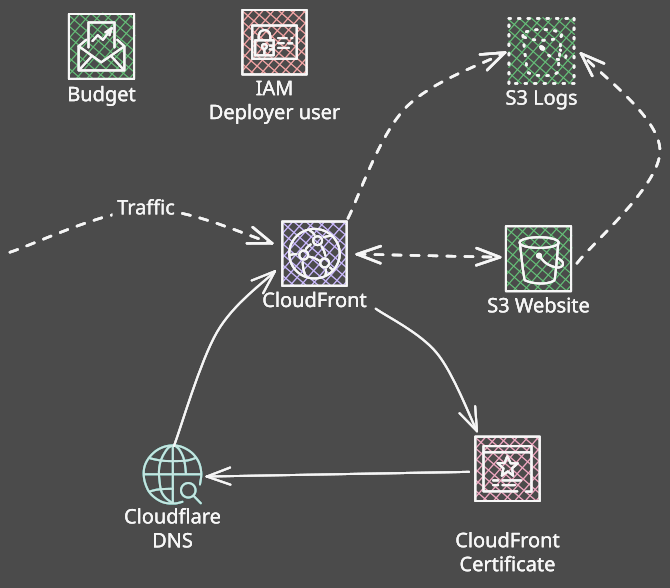

#+title: Static website hosting on AWS S3 with Terragrunt as IaC
#+date: [2025-11-03 11:06]
#+lastmod: [2025-12-16 15:01]
#+showLastmod: true
#+filetags: :aws:terragrunt:
#+tags[]: aws terragrunt
#+toc: true
#+description: Overview of hosting a static website on AWS S3 and CloudFront with Cloudflare DNS, managed via Terraform and Terragrunt. Includes example setups and configuration options.
#+summary: This article outlines a practical approach to hosting a static website on AWS S3 and CloudFront, with optional Cloudflare DNS integration. It explains the key components of the setup — including certificates, IAM, logging, and cost tracking — and shows how to manage the entire infrastructure using Terraform and Terragrunt. The post includes example snippets and alternative configurations rather than a strict step-by-step guide.

* Introduction

In this article, I would like to describe a simple hosting solution for a static website built using on AWS CloudFront and S3. Additionally, I will present process of creating and importing this infrastructure as Terraform code. I'm not going to explain every aspect of the process, so some familiarity with AWS, Terraform/OpenTofu and Terragrunt is required (or at least a willingness to expore these topics further)
{}
This is *NOT* step-by-step guide on setting up CloudFront and S3 - there are better articles available for that [[[#footnotes][1]]], including some in the AWS documentation [[[#footnotes][2]]][[[#footnotes][3]]]
{}
The full solution is available in the [[https://github.com/mandos/personal-website][github.com/mandos/personal-website]] repository (dir: [[https://github.com/mandos/personal-website/tree/master/terragrunt][/terragrunt]]).
{}
In the rest of this post, when I use name Terraform, I actually mean either OpenTofu or Hashicorp Terraform. To the best of my knowledge, I don't use any features or structures that are unique to only one of these systems.
{}

* Rationale of the choice

There are many cheap or even free solutions for hosting static websites. Some examples include [[https://pages.cloudflare.com/][Cloudflare Pages]], [[https://docs.gitlab.com/user/project/pages/][GitLab Pages]], [[https://pages.github.com/][GitHub Pages]], [[https://www.netlify.com/][Netlify]] or even [[https://www.digitalocean.com/][DigitalOcean]]. I'm not going pretend that I performed an in-depth comparision of these solutions with AWS. Even within AWS, instead of using basic S3 and CloudFront setup, I could have used [[https://aws.amazon.com/amplify/][AWS Amplify]]. My choice was driven by my familiarity with AWS Cloud, a good balance between cost and features, and the possibility of easly extending the setup in the future with other AWS services such as databases, WAF, or Lambda functions. For this project - personal website - this level of analysis is good enough.

The decision to manage DNS with Cloudflare was driven by the fact that my original domain provider didn't offer an easy way to redirect my main domain to the CloudFront distribution. Additionally, managing Cloudflare resourses with Terraform is quite easy, which influenced my decision. I could have used AWS Route53 for a more homogeneous setup, but why risk an outage with just one service provider when I can double the chances by using two?

Last but not least, choosing Terragrunt/Terraform as the main tool for infrastructure as Code was driven by my familiarity with it, my desire to refresh my knowledge, and my belief that infrastructure should always be managed through code. Maybe in this case it's a bit of overeineering - importing resoures was annoying, and I could have achived results much faster by just "clicking" the setup together. But I couldn't help myself.

* Architecture
:PROPERTIES:
:CUSTOM_ID: architecture
:END:

Ther architecture is quite simple: a publicly accessible S3 bucket with the website hosting feature enabled, and CloudFront distribution pointing to this S3 bucket. AWS Certificate Manager provides an SSL/TLS certificate for CloudFront, certificate verification is done using DNS records. It's worth mentioning that the certificate must be generated in the us-east-1 (N. Virginia) region. As part of the AWS setup, there's also an IAM User responsible for deploying the website to S3 and invalidating the CloudFront cache. The cherry on top is an AWS Budget - to make sure my cheap hosting stays cheap.

The Cloudflare setup includes DNS verification records for the AWS certificate and a CNAME record for the apex domain pointing to CloudFront (handled through [[https://developers.cloudflare.com/dns/cname-flattening][CNAME flattening]]). It also includes a redirect from the *www* subdomain to the apex domain.
{}
Implement the infrastructure for logging.
{}
To keeps logs from CloudFront and S3 I created an additional S3 Bucket - this time with private access only.

** AWS
*** S3 Website
As mentioned in [[#architecture][the Architecture]] section, the setup is simple: enable *Static Website Hosting*, set the *Index Document* to *index.html*, disable *Block Public Access*, and configure the bucket policy as follows:

#+begin_src json
{
    "Version": "2012-10-17",
    "Id": "Policy1397632521960",
    "Statement": [
        {
            "Sid": "AllowPublicAccess",
            "Effect": "Allow",
            "Principal": {
                "AWS": "*"
            },
            "Action": "s3:GetObject",
            "Resource": "arn:aws:s3:::<BUCKET NAME>/*"
        }
    ]
}
#+end_src

This allows us not to worry about URLS ending with "*/*", because the bucket automaticaly servers *index.html* from subdirectories. The downside of this solutions is that there is still direct access to the S3 bucket, bypassing Cloudfront.
{}
The website will be kept in the bucket's ROOT directory.
{}
An alternative approach would be to set up private access to the bucket (turn *Block Public Access* on), disable *Static Website Hosting*, and allow access to the bucket only through CloudFront using *Orgin Access Control(OAC)* or the legacy *Origin Access Identity(OAI)* [[[#footnotes][4]]]. In this setup, we also need to handle *index.html* delivery for URLs ending with "*/*", which can be easly achived using a [[https://docs.aws.amazon.com/AmazonCloudFront/latest/DeveloperGuide/example_cloudfront_functions_url_rewrite_single_page_apps_section.html][CloudFront function]].

The bucket policy in this case should look more like this:

#+begin_src json
{
  "Version":"2012-10-17",
  "Statement": [
    {
      "Sid": "AllowCloudFrontServicePrincipalReadOnly",
      "Effect": "Allow",
      "Principal": {
        "Service": "cloudfront.amazonaws.com"
      },
      "Action": "s3:GetObject",
      "Resource": "arn:aws:s3:::<BUCKET NAME>/*",
      "Condition": {
        "StringEquals": {
          "AWS:SourceArn": "arn:aws:cloudfront::<ACCOUNT ID>:distribution/<CLOUDFRONT DISTRIBUTION ID>"
        }
      }
    }
  ]
}
#+end_src

*** Certificate (ACM)
:PROPERTIES:
:CUSTOM_ID: certificate
:END:

The certificate configuration is also straightforward, but since it will be used by CloudFront, it has to be created in the *us-east-1 (N. Virginia)* region. I created a cerfiticate for the *apex domain* and the *www* subdomain. It will be used only within AWS, so the export feature is no required. The validation method is *DNS*, the key algoritm is *RSA 2028* and that's it, done. All we need to do is set up verification records in [[#cloudflare][Cloudflare]] (or another provider), and we'll have a certificate that automatically renews every year.

*** CloudFront

This service my seem like the most complex part of the entire stack, but it's actually quite manageable. I'm using two alternate domain names (the apex domain and the *www* subdomain), and attached the certificate created in [[#certificate][Certificate (ACM)]]. For the security policy, I kept the recommended *TLSv1.2_2021*. I'm not using the default root object, as this will be handled by S3 Website Hosting or a CloudFront function.
For the price class, I chose the "middle" option (North America, Europe, Asia, Middle East, and Africa), but this depends on needs. For now, I don't need a Web Application Firewall (WAF) or any geographic restrictions.

Among other common settings, I configured a custom error page for the *403* HTTP code that points to */en/404.html* and returns a *404* response. This will override access denied errors from S3. It's not a perfect solution for incorrect URLs, but it's good enough. An alternative would be implement more sophisticated solution using CloudFront functions.
{}
Add a section with logging setup
{}
Setting origins depends on the choosen S3 setup. In the case of *Static Website Hosting*, the orgin domain should be set to the /S3 website endpoint/. For a private S3 bucket, the origin domain shoud be the /S3 endpoint/. Additionally, an *Orgin Access Control (OAC)* must be created and attached in the /Orgin access/ settings. For connection attempts, connection timeout, and respones timeout, I kept the default values (*3*, *10*, *30*).

I'm using only the defualt behaviour: *compression enabled*, *HTTP redirected to HTTPS*, and only *GET* and *HEAD* methods allowed. There are no restrictions for viewer access. I'm using the recommended *CashingOpimized* cache policy, with no origin request policy or response headers policy configured. If a private bucket is used, handling "nice URLs" (without /index.html/) must be done using a [[https://docs.aws.amazon.com/AmazonCloudFront/latest/DeveloperGuide/example_cloudfront_functions_url_rewrite_single_page_apps_section.html][Viewer request function]].

*** Deployment User (IAM)

This is a straightforward setup. Because I wanted to automated website deployment, I created *IAM User* with an access key that can upload and remove data from S3 (for synchronization) and invalidate the CloudFront cache. Even if this user's credentials were compromised, at least noo ne would be able to spin up an EC2 instance farm on my account. The inline policy I used for this user looks like this:

#+begin_src json
{
	"Version": "2012-10-17",
	"Statement": [
		{
			"Sid": "CloudFrontInvalidation",
			"Action": "cloudfront:CreateInvalidation",
			"Effect": "Allow",
			"Resource": "arn:aws:cloudfront::<ACCOUNT ID>:distribution/<CLOUDFRONT DISTRIBUTION ID>"
		},
		{
			"Sid": "S3Sync",
			"Action": [
				"s3:PutObject",
				"s3:ListBucket",
				"s3:DeleteObject"
			],
			"Effect": "Allow",
			"Resource": [
				"arn:aws:s3:::<BUCKET NAME>/*",
				"arn:aws:s3:::<BUCKET NAME>"
			]
		}
	]
}
#+end_src

*** AWS Budget

One of the nice features of this setup is setting a budged [[[#footnotes][5]]]. I haven't set up any automatic actions of the budget is exceeded, but at least I receive an email notification when the costs pass the treshold. It's not a perfect solution, but at least i get feedback about my spending and can take action before the situation gets out of hand.

In the current setup, the budget is configured as a *montly recurring* budget with a fixed value, based on *unblended costs*. I created only one alert -  at 80% of the forecasted costs - which send me an email (no actions configured).

*** S3 Logs
{}
Prepare this setup
{}

** CloudFlare
:PROPERTIES:
:CUSTOM_ID: cloudflare
:END:

Again, the setup is not complicated at all. Create a CNAME record for the *apex domain* pointing to the CloudFront domain. Add another CNAME record for the *www* subdomain pointing to the *apex domain*, and one or more records for AWS certificate validation.

* IaC with Terragrunt

Keeping the infrastructure configuration for such a simple setup might seem like a bit of an over-exaggeration, but it also gave me a chance to refresh this part of my knowledge and experiment with Terragrunt. I like the way Terragrunt structures code — it feels organic and natural to me.

So, what’s Terragrunt’s approach? It’s based on small, self-contained units of code called... [[https://terragrunt.gruntwork.io/docs/features/units/][units]]. Each unit resides in a separate directory, and the structure of these directories mirrors the actual infrastructure. This approach provides a lot of flexibility in mapping infrastructure to code.

Parts of the directory tree are treated as [[https://terragrunt.gruntwork.io/docs/features/stacks/][stacks]] — groups of units that can be updated as a whole. Terragrunt automatically checks the dependencies between individual units and creates one or more stages to update the infrastructure in the correct order. This way of creating stacks is implicit, but there’s also an explicit approach, each with its own pros and cons.

Terragrunt promotes keeping Terraform states small, maintaining a clear separation of concerns, and defining a well-structured hierarchy and dependency chain between units. Of course, it adds another level of abstraction on top of Terraform/OpenTofu, which can sometimes lead to strange behaviors and hard-to-debug errors. Still, in my opinion, the pros heavily outweigh the cons.

More information can be found in [[https://terragrunt.gruntwork.io/docs][Terragrunt's documentation]].

** Code structure

My approach was to create an implicit stack in [[https://github.com/mandos/personal-website/tree/master/terragrunt][/terragrunt]] directory. Most of the directories there are units; the one exception is //modules/ directory, which contains small modules written by me.

#+begin_src
terragrunt
    ├── budget
    ├── certificate
    ├── cloudfront
    ├── cloudfront-common
    ├── dns
    ├── modules
    │   ├── budget
    │   ├── certificate
    │   ├── cloudfront-common
    │   └── dns
    ├── s3-website
    ├── user-deployer
    ├── provider_aws.hcl
    ├── provider_cloudflare.hcl
    ├── root.hcl
    └── stack.yaml
#+end_src

I consider using [[https://terragrunt.gruntwork.io/docs/features/stacks/#choosing-between-implicit-and-explicit-stacks][an explicit stack]], but to justify the overhead of that approach, I would need at least two different environments (e.g., /dev/ and /prod/).

I used a few common files in the root stack directory (/root.hcl/, /provider-aws.hcl/, /provider-cloudflare.hcl/, /stack.yaml/). The root file is responsible for backend generation, while the provider files contain code for generating each respective provider. All autogenerated files have the prefix *auto-*. In each unit's /terragrunt.hcl/ file, I always include /root.hcl/ and according the needs one or two provider files. Alternatively, everything could be places in the /root.hcl/ file, using conditional provider generation based on, for example, a local variable.

I didn't write all the modules used in the stack myself - most of them come from the long-established [[https://github.com/terraform-aws-modules][Terraform AWS modules]] GitHub organization. As mentioned before, whenever I need custom code, I put it in the /modules/ directory. I did consider writing everything from the scratch, especially since modules tailored to my needs would be simpler and more straightforward than the generic ones designed to cover a wide range of cases - but in the end, time constains won.
{}
This is always tricky ground — finding the right way to separate units, especially when third-party modules are involved. In some scenarios, separating units works fine; in others, it creates circular dependencies. A good example is S3 Bucket and CloudFront. For a public bucket, the dependency exists only on the CloudFront side. However, when using OAC, the bucket policy must include information about CloudFront, creating a circular relationship.
There are two possible solutions to this problem:
1. Combine both modules into a single Terraform state (unit).
   This usually resolves the issue, since the bucket policy is a separate resource and Terraform can build a correct DAG automatically.
2. Keep the modules in separate units, but hardcode some values — in this case, the CloudFront distribution details.
The first solution is cleaner, but the second one was easier to implement and still allowed me to maintain small, focused units.
{}
The solution is tailored to my needs, but I've tried to avoid hardcoded values as much as possible, even using the /stack.yaml/ file to store certain values used in the units. I expose these values through the /root.hcl/ file, although there could be also hcl file with locals [[https://terragrunt.gruntwork.io/docs/features/includes/#using-exposed-includes][directly included in the unit]].

** Working with code and importing resources

The perfect approach to IaC would be to simple sit down, write some code, apply the configuration to the real infrastructure, test it (automatically), and open a bottle of champagne. Unfortunately, this can be done with a high level of familiarity - not only with the infrastructure systems being configured but also with Terraform's abstraction layer (resourses and modules). Good autocompletion tools can help mitigate this to some extent, but nothing replaces solid, hand-on knowledge.

For this setup, I had already created some parts of the infrastructure in the AWS Console, but had almost no code. I also wasn't entiresly sure whether everything was configured correctly - for example, I was still undecided between using a plbuic or private bucket.
My usual workflow looks like this:
1. Write some code for part of the solution (usually a Terragrunt unit).
2. Import the existing configuration using *terragrunt import*.
3. Adjust the code to synchronize it with the current infrastructure.
4. Test different variants of configuration:
   + If changes are made directly in AWS Console, I have to apply step 3.
   + If changes are made directly in code, I'm done.

Once I was satisfied with the results, I moved on to the next unit (step 1) and repeated the process.
{}
Usually, importing resources is not a big problem - the parameters required by import are descibed in provider's documentation, and values like ID or name can be found in AWS Console or a similar tool. One problem I encountred was importing Cloudflare DNS records, which required ID that I couldn't find in the Cloudflare Dashboard. The only way I found to do it was using API to retrieve this information (https://developers.cloudflare.com/api/resources/dns/subresources/records/methods/list/)
{}

* Summary

At the end, I achieved what I wanted — a simple and cost-effective setup for static website hosting, fully managed through infrastructure-as-code. Both parts of the solution can still be improved. For example, I currently don’t have access logs, only some CloudFront telemetry and reports (which, by the way, are quite good).

The code itself could also be made more generic to form a complete static hosting solution as a dedicated Terragrunt stack.
Overall, though, I’m quite happy with how the setup turned out.

* Comments



* Footnotes
:PROPERTIES:
:CUSTOM_ID: footnotes
:END:
1. [[https://www.glukhov.org/post/2024/06/deploy-hugo-site-to-aws/#7-update-your-configtoml][Deploy Hugo site to AWS S3 - Rost Glukhov | Personal site and technical blog]]
2. [[https://docs.aws.amazon.com/AmazonS3/latest/userguide/website-hosting-custom-domain-walkthrough.html][Tutorial: Configuring a static website using a custom domain registered with ...]]
3. [[https://repost.aws/knowledge-center/cloudfront-serve-static-website][Use CloudFront to serve a static website hosted on Amazon S3 | AWS re:Post]]
4. [[https://docs.aws.amazon.com/AmazonCloudFront/latest/DeveloperGuide/private-content-restricting-access-to-s3.html][Restrict access to an Amazon S3 origin - Amazon CloudFront]]
5. [[https://docs.aws.amazon.com/cost-management/latest/userguide/budgets-managing-costs.html][Managing your costs with AWS Budgets - AWS Cost Management]]
